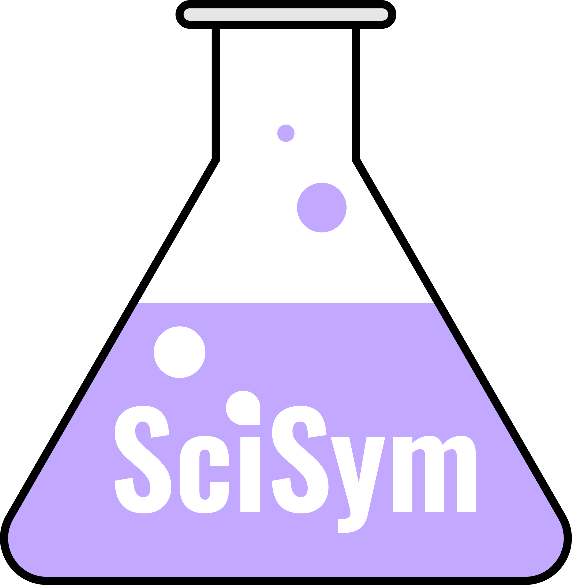

<div align="center">


# SciSym
Insert scientific symbols using customisable keyboard shortcuts.

[](https://github.com/Benjamin-Park/SciSym/releases)
[](./CHANGELOG.md)
[](./LICENSE)

</div><br>

## Getting Started
#### All platforms
Download the [latest release](https://github.com/Benjamin-Park/SciSym/releases/latest) python source code files.
Ensure that all [dependencies](#prerequisites) are installed. To launch SciSym execute `main.py`

```sh
python -m main.py
```

#### Linux
Binary packages are not currently available. See [all platforms](#all-platforms) for instructions for running from source and ensure that your distro uses `python3`. Precompiled `rpm` and `deb` packages may be released in future.

#### Windows
Download and extract the [latest release](https://github.com/Benjamin-Park/SciSym/releases/latest/download/scisym-win32.zip) binary for Windows or the python source files for any platform. To launch SciSym run `SciSym.exe`

## Prerequisites
- [Python 3.6+](https://www.python.org/downloads/)
- pynput

```sh
python -m pip install -r requirements.txt
```


## Using SciSym

### Default Shortcut Mappings:

| <hr><h4>**General** ||
| ------- | -------- |
| **Command** | **Shortcut** |
| Exit SciSym Application | <kbd>Ctrl</kbd> + <kbd>Alt</kbd> + <kbd>I</kbd> + <kbd>Esc</kbd> |
| <hr><h4>**Greek Alphabet** ||
| **Command** | **Shortcut** |
| `Δ` Insert `Greek Delta` | <kbd>Ctrl</kbd> + <kbd>Alt</kbd> + <kbd>I</kbd> + <kbd>D</kbd> |
| `δ` Insert `Greek Delta (lowercase)` | <kbd>Ctrl</kbd> + <kbd>Alt</kbd> + <kbd>I</kbd> + <kbd>F</kbd> |
| `λ` Insert `Greek Lambda (lowercase)` | <kbd>Ctrl</kbd> + <kbd>Alt</kbd> + <kbd>I</kbd> + <kbd>L</kbd> |
| `π` Insert `Greek Pi (lowercase)` | <kbd>Ctrl</kbd> + <kbd>Alt</kbd> + <kbd>I</kbd> + <kbd>P</kbd> |
| <hr><h4>**Mathematics** ||
| **Command** | **Shortcut** |
| `×` Insert `Multiply` symbol | <kbd>Ctrl</kbd> + <kbd>Alt</kbd> + <kbd>I</kbd> + <kbd>M</kbd> |
| `±` Insert `Plus/Minus` symbol | <kbd>Ctrl</kbd> + <kbd>Alt</kbd> + <kbd>I</kbd> + <kbd>-</kbd> |
| `≠` Insert `Not Equal` symbol | <kbd>Ctrl</kbd> + <kbd>Alt</kbd> + <kbd>I</kbd> + <kbd>N</kbd> |
| `≤` Insert `Less-than or Equal to` symbol | <kbd>Ctrl</kbd> + <kbd>Alt</kbd> + <kbd>I</kbd> + <kbd>,</kbd> |
| `≥` Insert `Greater-than or Equal to` symbol | <kbd>Ctrl</kbd> + <kbd>Alt</kbd> + <kbd>I</kbd> + <kbd>.</kbd> |
| `°` Insert `Degree` symbol | <kbd>Ctrl</kbd> + <kbd>Alt</kbd> + <kbd>I</kbd> + <kbd>A</kbd> |
| <hr><h4>**Chemistry** ||
| **Command** | **Shortcut** |
| `⟶` Insert `Reaction Arrow` symbol | <kbd>Ctrl</kbd> + <kbd>Alt</kbd> + <kbd>I</kbd> + <kbd>R</kbd> |
| `⇌` Insert `Equilibrium` symbol | <kbd>Ctrl</kbd> + <kbd>Alt</kbd> + <kbd>I</kbd> + <kbd>E</kbd> |
| <hr><h4>**Logic** ||
| **Command** | **Shortcut** |
| `∴` Insert `Therefore` symbol | <kbd>Ctrl</kbd> + <kbd>Alt</kbd> + <kbd>I</kbd> + <kbd>/</kbd> |

## Customising
Shortcuts can be changed by editing the `shortcuts.json` file. If two or more commands are bound the same shortcut key, only the last one defined in the file will be triggered.

A shortcut is structured as follows:
```json
"category":
{
  "symbol":
  {
    "key": "k",
    "char": "?"
  }
}
```

e.g. Insert a smiley face `☺` when <kbd>Ctrl</kbd> + <kbd>Alt</kbd> + <kbd>I</kbd> + <kbd>S</kbd> is pressed
```json
"custom":
{
  "smiley_face":
  {
    "key": "s",
    "char": "☺"
  }
}
```
